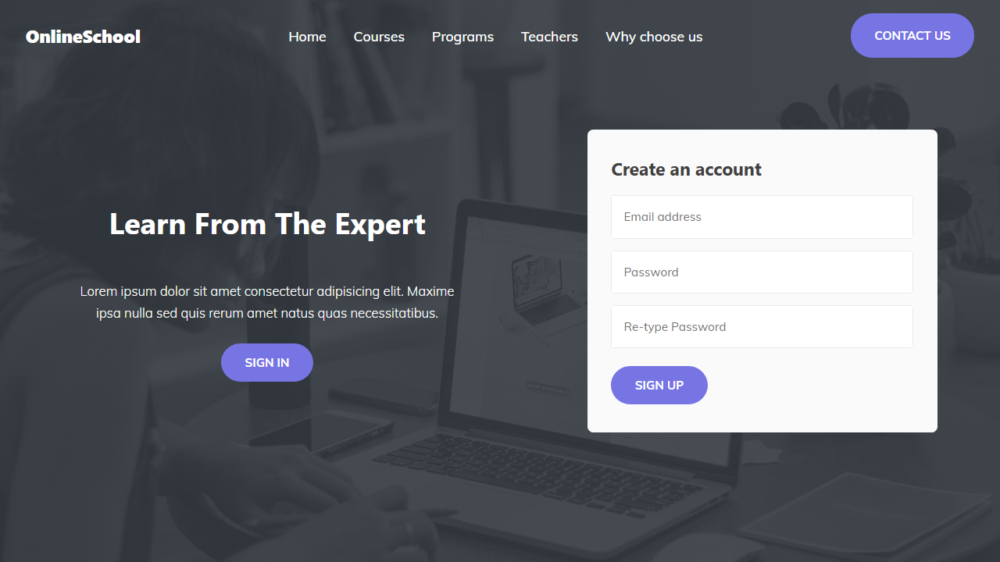

# Online Learning Website

> Website made with HTML, CSS and JS.

## Table of contents

- [General info](#general-info)
- [Screenshots](#screenshot)
- [Technologies](#technologies)
- [Setup](#setup)
- [Status](#status)

## General info

I made this project to put into practice everything that I know until now.

I learned a lot of things from this project such as:  
* The difference between relative and absolute positions.  
* How to use z-index to stack an element above another.  
* The importance of color contrast.  
* Create a parallax scrolling effect.  
* Create a sticky and responsive navigation bar.  
* Use npm to install packages.  

This was the first time that I have used SASS and HTML5 Boilerplate.  
I did a basic usage of it but just being able to nest classes with SASS is awesome. 
I'll tinker around with it to learn how to use it properly for future projects.

Completing this project wasn't hard but very time-consuming, but I'm happy with the result. I'm looking forward to learning more things with the next project.

## Screenshot

## Technologies

- HTML
- CSS
- JS
- [HTML5 Boilerplate](https://github.com/h5bp/html5-boilerplate)
- [SASS](https://github.com/sass/sass)
- [AOS](https://michalsnik.github.io/aos/)

## Setup

- [Demo](https://youthful-brattain-217b8e.netlify.app/)

## Status

Project is: _finished_
